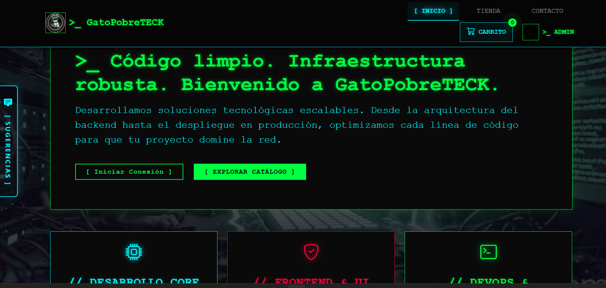
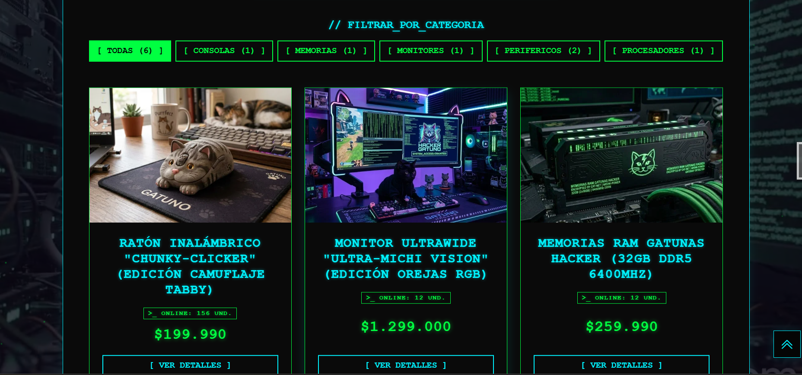
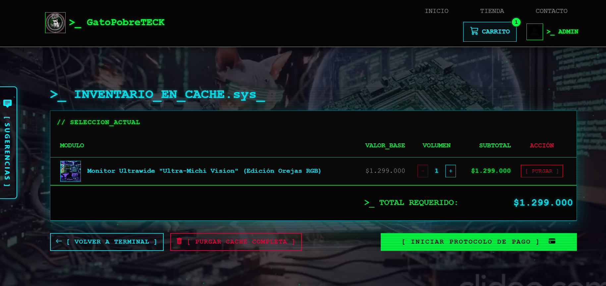
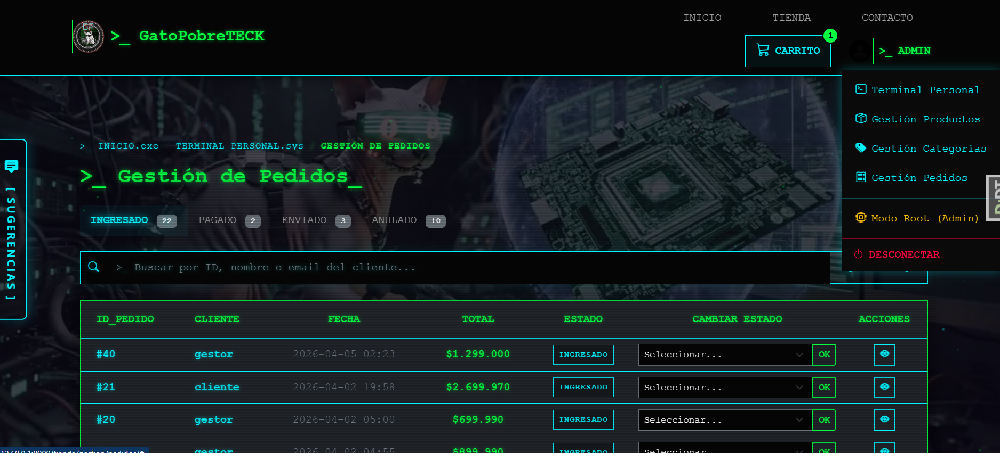

# 🐈‍⬛ GatoPobreTECK - E-commerce Cyberpunk

Plataforma de comercio electrónico (E-commerce) desarrollada en **Django 6.0** enfocada en la venta de hardware y "neuro-procesadores". Cuenta con un diseño inmersivo Cyberpunk, modo sigilo (claro/oscuro), accesibilidad mejorada (WCAG AA), y protección contra vulnerabilidades web (OWASP).

---

## 🔗 Enlace al Repositorio

**GitHub:** [https://github.com/GatoPobre/PORTAFOLIO_FINAL](https://github.com/TU_USUARIO/TU_REPOSITORIO)

## � Características Principales

- **Frontend Dinámico y Accesible:** Interfaz*Glassmorphism*, modo claro/oscuro persistente, notificaciones Toast (AJAX), y navegación mediante Migas de Pan (Breadcrumbs).
- **Mejora Progresiva (AJAX):** Paginación asíncrona ("Cargar Más") y gestión del carrito de compras sin recargar la página.
- **Módulo de Feedback Avanzado:** Permite a los usuarios enviar reportes de errores adjuntando automáticamente una captura del DOM (mediante`html2canvas`) y datos del navegador.
- **Seguridad Robusta:** Cabeceras HTTP estrictas (`X-Frame-Options`,`X-Content-Type-Options`), protección CSRF, y prevención nativa de ataques XSS y Clickjacking.
- **SEO y Rendimiento:** Datos estructurados (`JSON-LD`) para productos, compresión de archivos estáticos CSS/JS con`django-compressor` y conversión automática de imágenes a formato`.webp`.

---

## 🛣️ Rutas Principales

**Públicas / Cliente:**

- `/` : Inicio (Landing Page)
- `/tienda/` : Catálogo de Productos
- `/tienda/producto/<id>/` : Detalle del Producto
- `/tienda/carrito/` : Carrito de Compras
- `/tienda/checkout/` : Confirmación y Pago
- `/login/`,`/register/` : Autenticación

**Administración (Requieren permisos):**

- `/tienda/gestion/` : Panel de Gestión de Inventario (CRUD Productos)
- `/tienda/gestion/categorias/` : Panel de Gestión de Categorías
- `/tienda/gestion/pedidos/` : Panel de Gestión de Pedidos y Cambio de Estados
- `/admin/` : Panel de Administración Core (Solo Root/Superuser)

---

## 🛠️ Tecnologías y Dependencias

- **Backend:** Python 3.x, Django 6.0.2
- **Base de Datos:** MySQL (`mysqlclient`)
- **Frontend:** HTML5, CSS3 nativo, Bootstrap 5, Vanilla JavaScript.
- **Procesamiento de Imágenes:** Pillow (Optimizador WebP).

---

## ⚙️ Instalación y Despliegue Local

Sigue estos pasos para ejecutar el proyecto en un entorno de desarrollo local.

### 1. Clonar el repositorio y configurar el Entorno Virtual

```bash
# Clonar o extraer el proyecto
cd mi_projecto

# Crear entorno virtual
python -m venv .venv

# Activar el entorno virtual (Windows)
.venv\Scripts\activate

# Activar el entorno virtual (Linux/Mac)
# source .venv/bin/activate
```

### 2. Instalar dependencias

```bash
pip install -r requirements.txt
```

### 3. Configurar Variables de Entorno

El proyecto utiliza `python-dotenv` para mantener las credenciales seguras.

1. Copia el archivo de ejemplo:
   ```bash
   cp .env.example .env
   ```
2. Abre el archivo`.env` recién creado y configura tus credenciales de MySQL locales.

### 4. Migraciones de Base de Datos

Asegúrate de tener tu servidor MySQL encendido y la base de datos (indicada en tu `.env`) creada.

```bash
python manage.py migrate
```

### 5. Configuración Inicial del Sistema (Comandos Personalizados)

El proyecto incluye un script automatizado para generar los grupos de permisos y usuarios de prueba iniciales:

```bash
python manage.py create_roles
```

_Este comando creará los roles (Administrador, Gestor de Inventario, Cliente) y dos usuarios de prueba: `cliente` y `gestor` (password: `pera1234`)._

### 6. Iniciar el Servidor de Desarrollo

```bash
python manage.py runserver
```

Visita `http://127.0.0.1:8000/` en tu navegador.

---

## 📦 Comandos de Mantenimiento

El proyecto incluye comandos de administración (`management commands`) para facilitar el mantenimiento del servidor:

- **Limpieza de Caché de Reportes:** Elimina los feedbacks y sus capturas de pantalla asociadas que tengan más de 30 días de antigüedad (Ideal para ejecutar mediante`crontab` en producción).
  ```bash
  python manage.py clean_feedbacks --dias 30
  ```

---

## 📸 Capturas de Pantalla

<table align="center">
  <tr>
    <td align="center"><b>Inicio / Landing Page</b></td>
    <td align="center"><b>Catálogo de Productos</b></td>
  </tr>
  <tr>
    <td></td>
    <td></td>
  </tr>
  <tr>
    <td align="center"><b>Carrito y Checkout</b></td>
    <td align="center"><b>Panel de Gestión (Admin)</b></td>
  </tr>
  <tr>
    <td></td>
    <td></td>
  </tr>
</table>

---

## 🚀 Notas para Despliegue en Producción

Antes de desplegar en un servidor real (VPS, Heroku, Render, AWS), asegúrate de:

1. Cambiar a`DEBUG=False` en tu archivo`.env`.
2. Configurar los dominios permitidos en`ALLOWED_HOSTS` dentro de`settings.py`.
3. Recopilar y comprimir los archivos estáticos:
   ```bash
   python manage.py collectstatic --noinput
   python manage.py compress
   ```
4. Utilizar un servidor WSGI como`Gunicorn` respaldado por`Nginx` o`Apache`.

---

**Desarrollado con ☕ y 💻 para la Actividad Final del Portafolio Profesional.**
